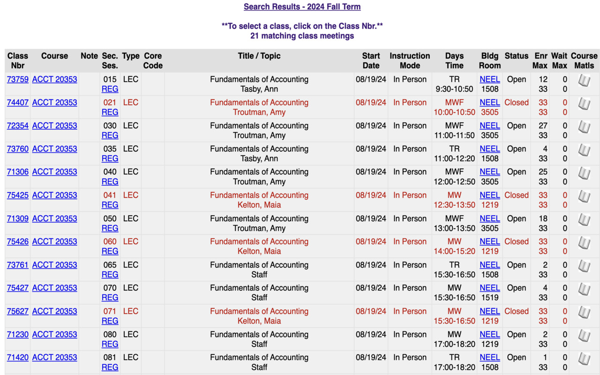

<h1 align="center">Rate My TCU Professors</h1>
TCU class extension with RateMyProfessor allows viewing professor ratings on classes.tcu without switching tabs
## Installation

### Option 1: One-click install (Preferred)
  
Link to extension: [Chrome Web Store](https://chromewebstore.google.com/detail/rate-my-tcu-professors/hkeobloofhgcbjmhgjgcfbnopikfmkjb?hl=en-US&utm_source=ext_sidebar)

### Option 2: Install directly from source code

1. Clone this repository
2. Launch Google Chrome
3. Navigate to "**chrome://extensions**"
4. Select "**Load unpacked**"
5. Select folder "**src/**" from this repository
6. Load extension

## Demo

TCU class search site without Rate My TCU Professors:

TCU class search site with Rate My TCU Professors:

